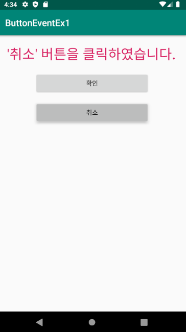

## ButtonEventEx1 학습내용

* 핵심 내용

  1. activity_main.xml의 Button들과 TextView에 id 지정

  2. 버튼 클릭 시 반응(TextView 문자열 내용 변경)하는 Event 생성
     2-1 무명의 이벤트 리스너 클래스를 통해 등록하는 방법

     ```java
     // (1) 무명의 이벤트 리스너 클래스를 톻해 등록하는 방법
     btnOk.setOnClickListener(new View.OnClickListener() {
         @Override
         public void onClick(View v) {
             tvOut.setText("'확인' 버튼을 클릭하였습니다.");
         }
     });
     ```

     2-2  View.OnClickListener 상속을 통한 구현 방법

     ```java
     // (2) View.OnClickListener 상속을 통한 구현 방법
     ButtonClickListener listener = new ButtonClickListener();
     
     // 각 위젯에 이벤트 리스너 등록
     btnOk.setOnClickListener(listener);
     btnCancel.setOnClickListener(listener);
     
     class ButtonClickListener implements View.OnClickListener {
         @Override
         public void onClick(View v) {
             switch (v.getId()) {
                 case R.id.button_ok:
                     tvOut.setText("'확인' 버튼을 클릭하였습니다.");
                     break;
     
                 case R.id.button_cancel:
                     tvOut.setText("'취소' 버튼을 클릭하였습니다.");
                     break;
             }
         }
     }
     
     ```

  3. 버튼을 장시간 클릭 시 반응(TextView 문자열 내용 변경)하는 Event 생성

     ```java
     LongClickListener long_listener = new LongClickListener();
     
     btnOk.setOnLongClickListener(long_listener);
     btnCancel.setOnLongClickListener(long_listener);
     
     class LongClickListener implements View.OnLongClickListener {
         @Override
         public boolean onLongClick(View v) {
             switch (v.getId()) {
                 case R.id.button_ok:
                     tvOut.setText("확인 버튼을 길게 눌렀습니다.");
                     break;
                 case R.id.button_cancel:
                     tvOut.setText("취소 버튼을 길게 눌렀습니다.");
                     break;
             }
             return true;
         }
     }
     ```

     

* 결과화면

  * 초기 화면
    
  * 버튼 (짧게) 클릭 시 
    * 확인 버튼 클릭 시
      
    * 취소 버튼 클릭 시
      
  * 버튼 (길게) 클릭 시 
    * 확인 버튼 클릭 시
    * 취소 버튼 클릭 시
      